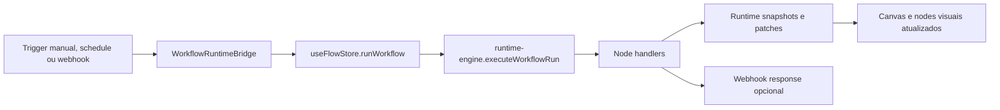
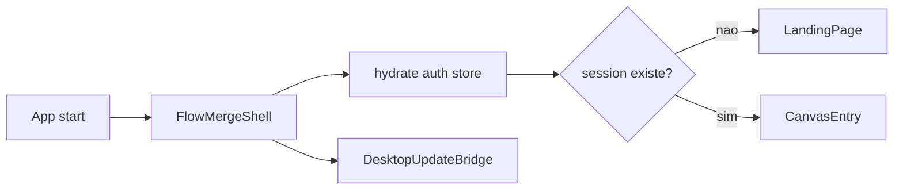

# System Design

## Visao geral

Flow Merge combina um frontend React/Next.js com um shell desktop em Tauri 2.

O sistema e local-first:

- a interface roda localmente
- a autenticacao e local
- o runtime de webhooks e local
- os stores analiticos sao locais
- os updates desktop sao controlados por canais

## Stack

### Frontend

- Next.js 16
- React 19
- Tailwind CSS 4
- Framer Motion
- React Flow
- Zustand
- Recharts
- Monaco Editor

### Desktop

- Tauri 2
- Rust
- Axum
- tokio
- tauri-plugin-updater
- tauri-plugin-process

## Camadas

### 1. App shell

Arquivos principais:

- `src/app/page.tsx`
- `src/components/app/FlowMergeShell.tsx`

Responsabilidades:

- iniciar a app
- hidratar autenticacao local
- decidir entre landing e canvas
- subir bridge de updater desktop

## 2. Autenticacao local

Arquivos principais:

- `src/store/useAuthStore.ts`
- `src/lib/local-auth.ts`

Modelo:

- conta local unica por maquina
- email normalizado
- senha derivada com PBKDF2 e salt
- sessao salva em localStorage

Objetivo:

- proteger o acesso ao workspace local sem depender de backend

## 3. Superficie do editor

Arquivos principais:

- `src/components/canvas/CanvasApp.tsx`
- `src/components/canvas/FloatingToolbar.tsx`
- `src/components/canvas/AddNodePanel.tsx`
- `src/components/canvas/NodeConfigPanel.tsx`
- `src/components/canvas/AIChatPanel.tsx`

Responsabilidades:

- renderizar o canvas
- editar nodes e edges
- navegar entre projeto e workflow
- abrir painel de configuracao
- abrir painel de IA
- mostrar ferramentas de desenho e operacao

## 4. Estado principal

Arquivo principal:

- `src/store/useFlowStore.ts`

O store central concentra:

- projetos
- workflows
- nodes e edges
- execucoes
- snapshots de runtime
- stores analiticos por projeto
- estado do chat
- configuracao de updater
- estado de UI do canvas

Ele funciona como orquestrador entre editor, runtime e desktop bridges.

## 5. Catalogo de nodes

Arquivos principais:

- `src/lib/node-catalog.ts`
- `src/lib/node-config.ts`
- `src/lib/node-docs.ts`
- `src/lib/node-programming.ts`

Esse conjunto define:

- tipos de node
- metadados visuais
- parametros editaveis
- documentacao
- comportamento de programacao

Categorias principais:

- Triggers
- Core
- Analytics
- Monitoring
- Visualization
- Integrations

## 6. Runtime engine

Arquivo principal:

- `src/lib/runtime-engine.ts`

Responsabilidades:

- identificar nodes de entrada
- propagar envelopes entre edges
- lidar com fan-out e fan-in
- executar handlers por tipo de node
- atualizar stores analiticos
- produzir patches para nodes visuais
- retornar resposta de webhook quando necessario

## Unidade de dados do runtime

O runtime trabalha com envelopes, que carregam:

- items
- meta
- artifacts

Isso permite que o mesmo fluxo transporte:

- dados processaveis
- informacao auxiliar
- saidas prontas para metricas, tabelas, series e reports

## 7. Runtime storage

Arquivos principais:

- `src/lib/runtime-storage.ts`
- `src/lib/runtime-types.ts`

Responsabilidades:

- persistir stores de runtime por projeto
- manter colecoes
- reidratar estado local
- suportar analytics local-first

## 8. Desktop runtime bridge

Arquivos principais:

- `src/components/runtime/WorkflowRuntimeBridge.tsx`
- `src/lib/tauri-runtime.ts`
- `src-tauri/src/lib.rs`

Responsabilidades:

- publicar rotas de webhook para o runtime Rust
- ouvir entregas do servidor local
- transformar entrega em execucao de workflow
- devolver resposta HTTP ao chamador
- expor `runtime_status` para a UI

## Servidor local

O shell Tauri embute um servidor Axum em `127.0.0.1:45431`.

Esse servidor:

- registra rotas de webhook ativas
- valida metodo HTTP
- valida segredo opcional
- emite evento para o frontend
- espera a conclusao do workflow
- responde ao cliente HTTP

## 9. Updater desktop

Arquivos principais:

- `src/lib/desktop-updater.ts`
- `src/components/runtime/DesktopUpdateBridge.tsx`
- `src-tauri/src/lib.rs`

Responsabilidades:

- expor configuracao do updater
- checar updates por canal
- baixar update em background
- instalar update pronto
- relancar ou encerrar a app

Modelo:

- feed por canal
- assinatura de update
- politica de instalacao no fechamento normal

## 10. Build e release

Arquivos principais:

- `.github/workflows/release-desktop.yml`
- `.github/workflows/promote-channel.yml`
- `scripts/build-updater-manifest.ts`
- `scripts/tauri-cli.ts`
- `scripts/updater-doctor.ts`

## Fluxo de execucao

## Fluxo de boot

## Persistencia local

Hoje o sistema persiste no cliente:

- conta local
- sessao local
- chave da IA
- updater preferences
- chat threads
- runtime stores

## Principios arquiteturais

- local-first sempre que possivel
- uma store central para coordenacao de UI e runtime
- runtime sem backend externo obrigatorio
- nodes visuais tratados como saida do proprio fluxo
- desktop como camada de distribuicao, webhook e update

## Limites atuais

- scheduling depende da sessao desktop aberta
- auth e local, nao multiusuario
- integracoes dependem de credenciais preenchidas manualmente no node
- grande parte do estado operacional vive no cliente

## Direcao desejada

- perfis de segredo por projeto
- scheduling em background mais robusto
- maior maturidade de observabilidade
- templates e playbooks por vertical
- expansao de conectores e runtime policies
